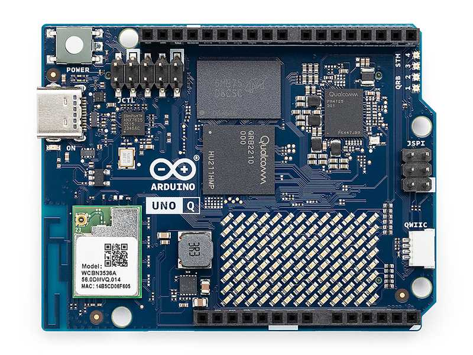

# 0 — Setup Guide

This section prepares your device and development environment before starting the hands-on labs.

The goal is to ensure all participants begin from the same baseline configuration.

---

## Hardware Platform

We will use the Arduino Uno Q running Debian-based Embedded Linux®.



Official resources:

- https://www.arduino.cc/product-uno-q
- https://docs.arduino.cc/hardware/uno-q/
- https://docs.arduino.cc/resources/datasheets/ABX00162-datasheet.pdf

---

## Hardware Setup

Before powering the device, connect:

- USB-C power supply
- USB-C hub
- Ethernet cable
- Microphone (USB audio device)
- Optional peripherals provided during the workshop

Recommended connection order:

1. Connect USB-C hub to the board
2. Connect microphone to USB-A port
3. Connect Ethernet cable
4. Connect power supply

---

## Network Connectivity

The workshop environment provides wired network access.

The board should obtain an IP address via DHCP automatically.

To verify:

```sh
ip addr
```

---

# Device Access Guide -- SSH, ADB, and Serial Console

This guide explains all supported ways to access your Arduino UNO Q
device during the workshop.

You can connect using:

-   SSH (over Wi-Fi / Ethernet)
-   ADB (over USB)
-   Serial Console (screen)

------------------------------------------------------------------------

# SSH Access (Network Required)

Use SSH when the device is connected to Wi-Fi or Ethernet and you know
its IP address.

Default credentials (after setup):

-   User: arduino
-   Password: fio

------------------------------------------------------------------------

## Linux

Open a terminal and run:

``` sh
ssh arduino@DEVICE_IP
```

Example:

``` sh
ssh arduino@192.168.20.20
```

If this is your first time connecting, accept the fingerprint by typing:

``` sh
yes
```

------------------------------------------------------------------------

## macOS

Open Terminal and run:

``` sh
ssh arduino@DEVICE_IP
```

Example:

``` sh
ssh arduino@192.168.20.20
```

------------------------------------------------------------------------

## Windows

### Option 1 --- Windows Terminal / PowerShell (Recommended)

Modern Windows versions include OpenSSH.

``` sh
ssh arduino@DEVICE_IP
```

If SSH is not installed:

-   Go to Settings → Optional Features
-   Install "OpenSSH Client"

------------------------------------------------------------------------

### Option 2 --- PuTTY

1.  Download PuTTY from: https://www.putty.org/

2.  Open PuTTY

3.  Enter DEVICE_IP

4.  Port: 22

5.  Connection type: SSH

6.  Click Open

Login with:

-   Username: arduino
-   Password: fio

------------------------------------------------------------------------

# ADB Access (USB Connection)

ADB allows you to access the device directly via USB without network.

## Check if device is detected

``` sh
adb devices
```

You should see:

    DEVICE_ID    device

## Open shell

``` sh
adb shell
```

## Run a single remote command

``` sh
adb shell <command>
```

Example:

``` sh
adb shell uname -a
```

## Debian Console Basics

The device runs a Debian-based distribution.

Useful commands:

```sh
ls
cd
ip addr
sudo
```

Check system information:

```sh
uname -a
cat /etc/os-release
```

---

## Changing WiFi via Console

List available interfaces:

```sh
ip link
```

Check wireless configuration tools available (example):

```sh
nmcli
```

Example workflow:

```sh
nmcli device wifi list
nmcli device wifi connect SSID password PASSWORD
```

(Exact steps may vary depending on environment.)

---

## Verify Microphone

Check audio devices:

```sh
arecord -l
```

---

## Install / Verify Git

Check if git is installed:

```sh
git --version
```

If not installed:

```sh
sudo apt update
sudo apt install git
```

---

## Clone Workshop Repository

```sh
git clone https://github.com/munoz0raul/ew-class-26
cd ew-class-26
```

---

## Verify Docker

Ensure Docker is available:

```sh
docker --version
docker info
```

---

## Ready for Lab 1

You are ready when:

- SSH works
- Ethernet connectivity confirmed
- Repository cloned
- Docker working
- Microphone detected

Proceed to:

```sh
1-hello-c
```