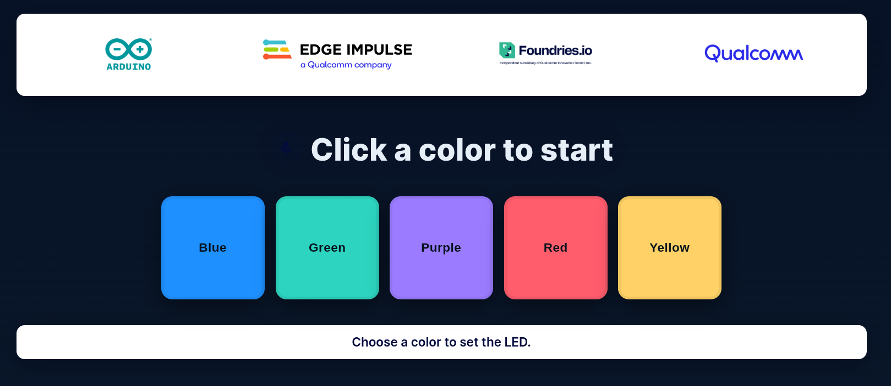

# BlinkLED + WebApp (Sysfs)

In this example, a Flask web app controls the system LEDs directly through sysfs. Each color tile works like a switch: click once to turn it on, click again to turn it off. The app writes to `/sys/class/leds/*/brightness`, keeping the LED control in user space.

Getting Started

Create and Enter a Directory

> [!NOTE] 
> Run the following commands on the device

```sh
device:~$ mkdir webapp-led
device:~$ cd webapp-led
```

Build the Flask App

Start with the `webapp-led.py` file:

```sh
vim webapp-led.py
```
[webapp-led.py](webapp-led.py)

Create the HTML File

```sh
vim index.html
```
[index.html](index.html)

Add the Logo Assets

These files are used in the header:

- [assets/arduino.png](assets/arduino.png)
- [assets/edgeimpulse.png](assets/edgeimpulse.png)
- [assets/foundries.png](assets/foundries.png)
- [assets/qualcomm.png](assets/qualcomm.png)

Create the Dockerfile

```sh
vim Dockerfile
```
[Dockerfile](Dockerfile)

Build and Run the Container

With all the files in the same folder, build the container and add the tag `webapp-led:latest` to it.

```sh
device:~$ docker build --tag webapp-led:latest .
```

Launch the Container

We must run with `--privileged` so the container can write to `/sys/class/leds/*`.

```sh
device:~$ docker run -it --network host -d --rm --name webapp-led --privileged webapp-led:latest
```

Open the page in your browser using the device IP:



Debugging

Check the Running Container

```sh
device:~$ docker ps
```

Check the Logs

```sh
device:~$ docker logs -f webapp-led
```

While follow the logs, click on the colors in the Browser and check the device to see if the LED changes.

If you see permission errors writing to `/sys/class/leds/*`, verify the container was started with `--privileged`.

Docker Compose

To simplify container management, create the `docker-compose.yml` file:

```sh
vim docker-compose.yml
```
[docker-compose.yml](docker-compose.yml)

Stop the Running Container

```sh
device:~$ docker stop webapp-led
```

Run the Application with Docker Compose

```sh
device:~$ docker compose up -d
```

Remove the running docker:
```sh
docker:~$ docker rm -f webapp-led
```

Return One Folder Up

```sh
device:~$ cd ..
```
Check the Logs of the Running Image
