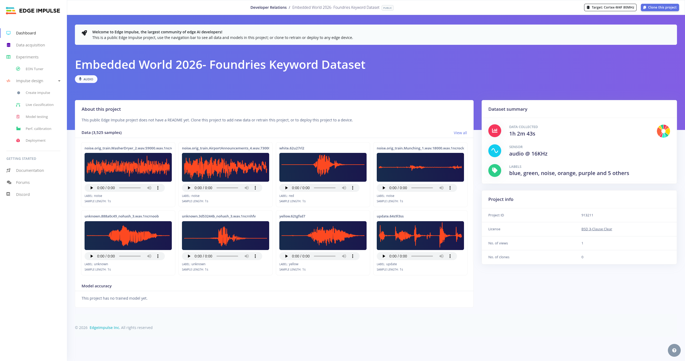
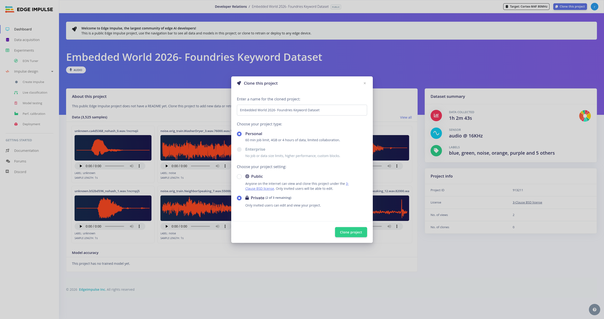
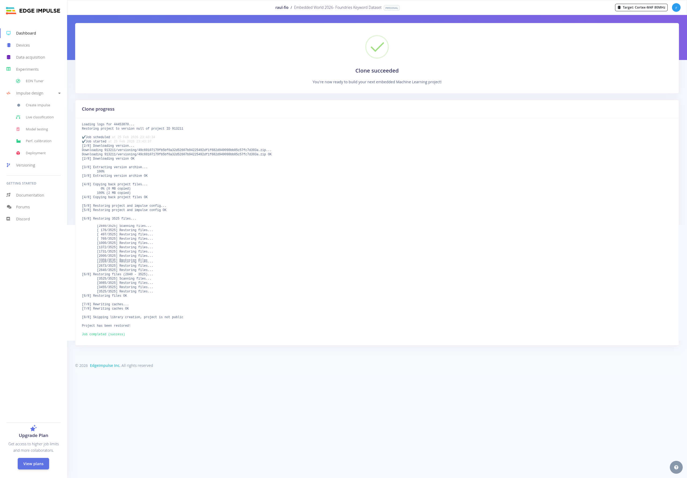
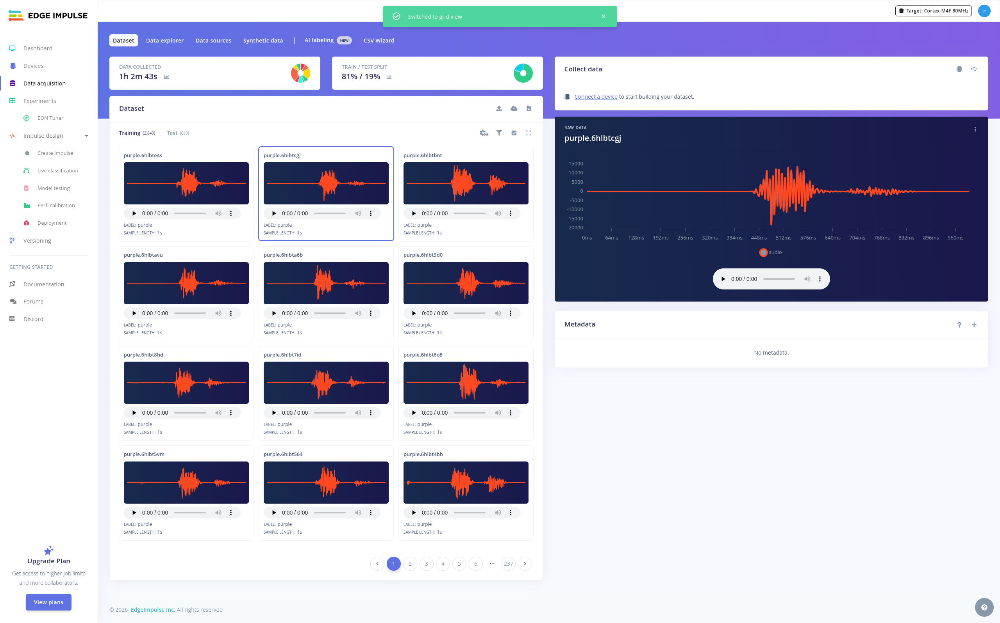
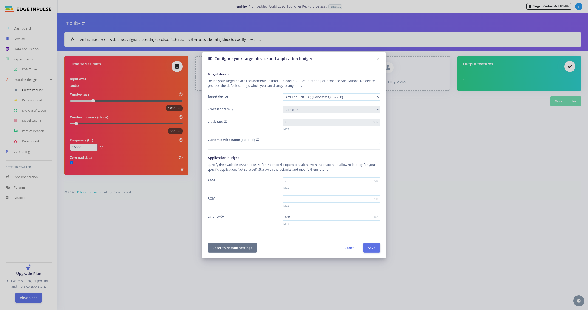
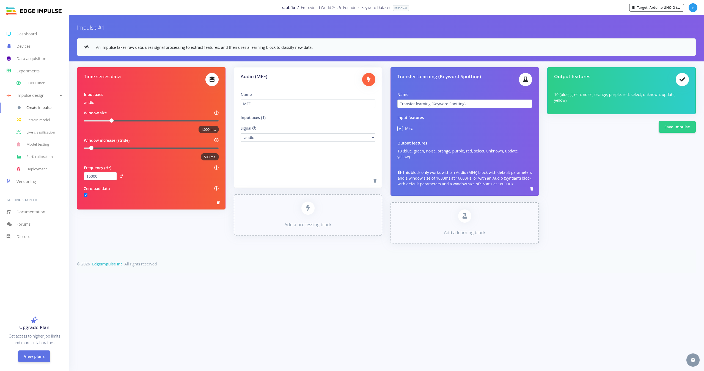
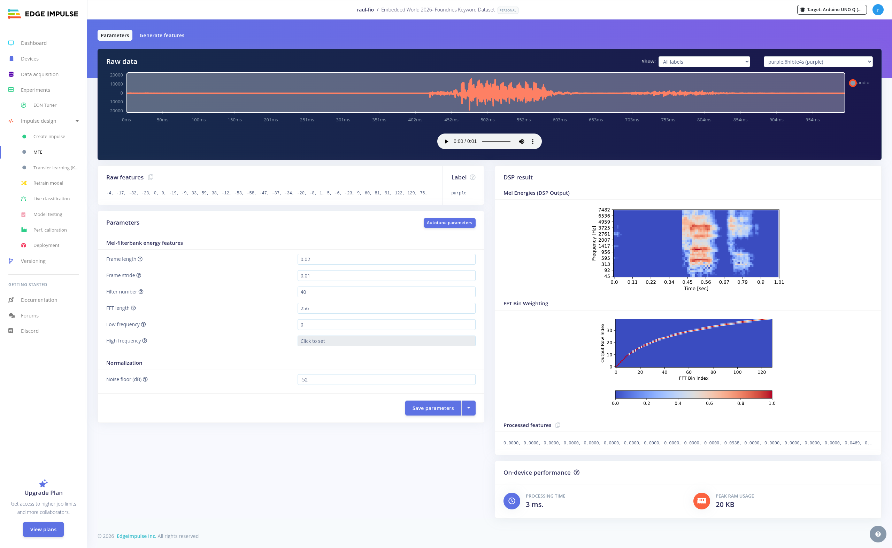
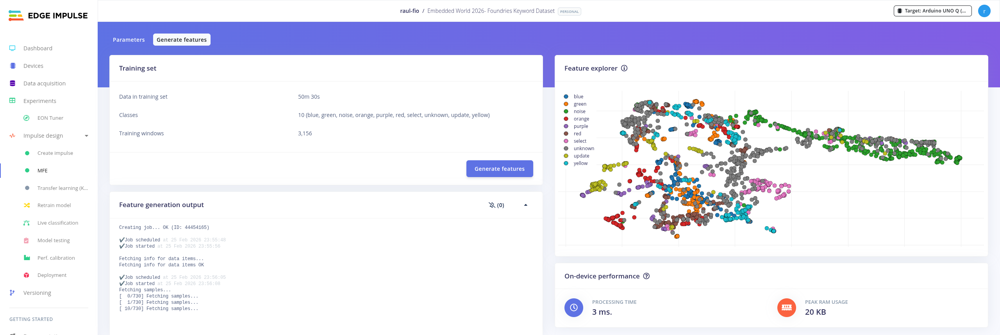
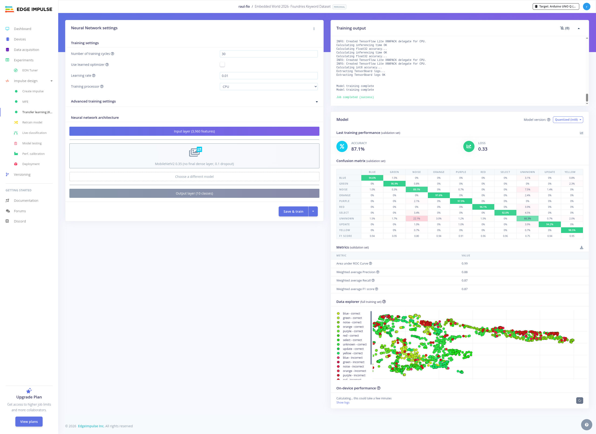
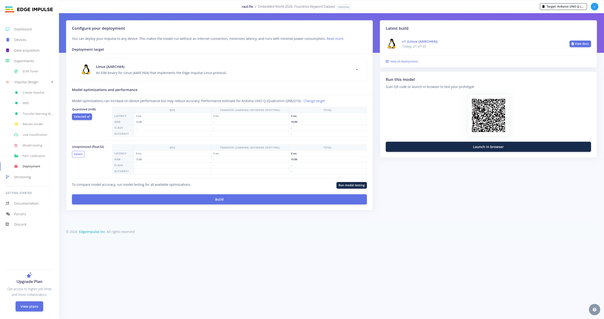

# Lab 7 — Edge Impulse Model Creation (7-edgeimpulse)

## Goal

Learn how to create and train an AI model using Edge Impulse and prepare it
for deployment on an Embedded Linux device.

---

## Why this matters

Modern embedded devices increasingly include AI workloads. Understanding how
to go from raw data → trained model → deployable artifact is critical to
moving from prototype to production.

---

## What you will build

In this lab you will:

- Create an Edge Impulse project
- Explore an existing dataset
- Generate features
- Train a model
- Validate performance
- Export a deployment-ready model (.eim)

---

## Steps

### 1) Clone the reference project

Open the public Edge Impulse project:

Embedded World 2026 – Foundries Keyword Dataset

Clone the project into your account.

This provides a prepared dataset so we can focus on the workflow instead of data collection.

---

### 2) Explore the dataset

Navigate to the Dataset view.

Inspect the audio samples and labels.

Understanding data quality is essential before training.

---

### 3) Create the Impulse

Go to:

Impulse Design → Create Impulse

Configure:

- Time series data (audio)
- Processing block: MFE
- Learning block: Transfer Learning (Keyword spotting)

Save the impulse configuration.

---

### 4) Generate Features

Open the MFE processing block.

Click:

Generate Features

Review:

- DSP parameters
- Feature visualization
- Mel spectrogram output

Feature explorer visualization helps identify separability between classes.

---

### 5) Train the Model

Open the Learning block.

Configure training settings and start training.

Review:

- Accuracy
- Loss
- Confusion matrix

---

### 6) Validate the Model

Use model testing or live classification tools.

Ensure model behavior is acceptable before deployment.

---

### 7) Deployment

Navigate to the Deployment tab.

Select:

Embedded Linux (AARCH64)

Download the deployment package (.eim file).

---

## Expected result

You should now have:

- A trained keyword spotting model
- Validated classification performance
- A downloadable .eim deployment artifact

---

## Transition to next lab

Next we will integrate the trained model into a containerized application
and use voice recognition to control hardware on the device.