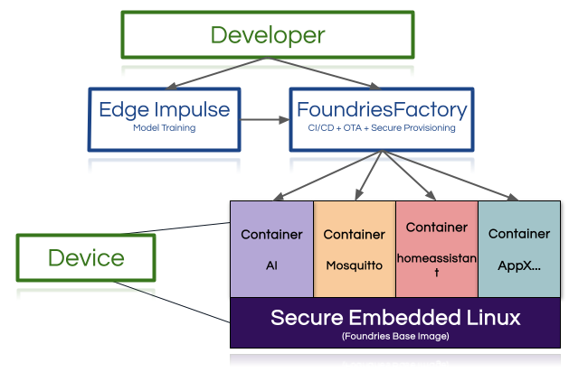

# Embedded World 2026 – Class 7.3
## From Vision to Deployment: Developing Secure AI-Enabled Linux Devices

**Instructor**  
Raul Rosetto Muñoz  
Technical Marketing Manager – Foundries.io

---

## Duration: 3.5 Hours

Learn how to develop AI-powered embedded Linux devices with a robust, secure, and scalable lifecycle — all in just 3.5 hours.

In this hands-on workshop, attendees will use Qualcomm-powered boards to combine the power of **FoundriesFactory** and **Edge Impulse**, two platforms now under the Qualcomm umbrella. Participants will experience a full development workflow: training a machine learning model with Edge Impulse (e.g., object detection), integrating it into a secure Embedded Linux build using FoundriesFactory, deploying it over-the-air, and managing devices with built-in CI/CD, OTA updates, and secure provisioning.

This session is ideal for embedded developers and AI engineers who want to bridge the gap between proof-of-concept and production. Boards and all necessary hardware will be provided on-site. Whether you're building smart cameras, edge AI devices, or any Linux-based product, you'll walk away with a working prototype and the tools to take it to market — faster, safer, and smarter.

---

## Learning Outcomes

By the end of this workshop, participants will be able to:

- Understand the key components of an embedded Linux development workflow using CI/CD
- Train and deploy a simple AI model for an edge use case (e.g., object or voice recognition)
- Integrate AI workloads into containerized Linux applications for embedded systems
- Deploy applications securely using over-the-air (OTA) updates
- Manage devices remotely through a CI/CD-enabled infrastructure
- Take home a practical, repeatable method for going from proof-of-concept to production-ready embedded AI devices

---

## Target Group

- Embedded Linux developers  
- IoT engineers  
- ML/AI engineers moving into embedded  
- Product managers building connected devices  
- Tech leads looking for secure deployment strategies  

---

## Prior Knowledge

- Basic understanding of Linux and embedded systems
- Familiarity with terminal/command-line tools
- Some exposure to containers (Docker) and/or CI/CD concepts is helpful, but not mandatory

---

## Important

This is a fully hands-on, in-person workshop. Each participant will work directly with a provided **Arduino Uno Q** board and their own laptop to follow the full development and deployment workflow.

---

## Equipment

Participants should bring their own laptops.

Participants should have:
- An SSH client
- A modern web browser

Recommended tools by operating system:

- **Windows:** Windows Terminal or PowerShell (built-in SSH support)  
  - Alternatively: PuTTY
- **Linux:** OpenSSH (usually pre-installed) + terminal application of choice
- **macOS:** Terminal (built-in SSH support)  
  - Alternatively: iTerm2

---

## Training Motivation

Last year at Embedded World, I delivered a hands-on training focused on Docker containers for embedded Linux. The goal was to demonstrate the importance of combining a well-maintained Linux distribution with containerized applications.

Containers solve many problems:
- Application portability across hardware platforms
- Isolation between base system and applications
- Simplified maintenance of the base distribution

However, I realized we could go further.

Today, embedded systems are no longer just connected — they are intelligent.

This year, I decided to extend the journey beyond containers and into AI-enabled devices. Instead of stopping at application isolation, we will walk through a complete lifecycle:

- From training an AI model  
- To integrating it into Embedded Linux  
- To deploying securely  
- To managing devices at scale  

This workshop demonstrates how to move from an idea to something close to production.

---

## Suggested Architecture

---

## What is Docker?

Docker is an open-source platform that automates the deployment, scaling, and management of applications within containers. It enables developers to package applications with all dependencies into isolated, portable units.

In embedded systems, Docker allows:
- Application portability across different hardware platforms
- Isolation from the base Linux distribution
- Simplified updates and lifecycle management

---

## Key Components of Docker

- **Docker Engine**: The core runtime responsible for building and running containers.
- **Docker Images**: Read-only templates used to create containers.
- **Docker Containers**: Runnable instances of Docker images.
- **Docker Registry**: A system for storing and distributing container images.

---

## What is a Docker Image?

A Docker image is a layered, read-only template containing:

- Application code  
- Dependencies  
- Runtime environment  
- Configuration  

Images are built using a **Dockerfile**.

---

## Key Concepts

### Layers
Each Dockerfile instruction creates a layer. Layers are cached to speed up builds.

### Base Image
The starting point for building a container image (e.g., debian, alpine).

### Multi-Stage Builds
Allow separation between build environment and runtime environment, producing smaller and more secure final images.

### Container Isolation
Containers isolate applications from the base OS while sharing the same kernel.

---

## Repository Structure

This repository contains the step-by-step labs used during the hands-on workshop.

Suggested flow:

- `0-setup`
- `1-hello-c`
- `2-multi`
- `3-blinkled`
- `4-webapp`
- `5-webapp-led`
- `6-webapp-led-mcu`
- `7-edgeimpulse`
- `8-led-voice`
- `9-webapp-led-mcu-voice`
- `10-foundriesfactory`

Each folder contains a dedicated `README.md` with hands-on instructions.

---

## Notes

- Some labs require privileged access to control hardware interfaces (e.g., LEDs, audio, MCU bridge).
- Follow each lab README carefully and keep terminal output visible for debugging.
- If you get stuck during the workshop, ask the instructor — the goal is to leave with a working end-to-end prototype.